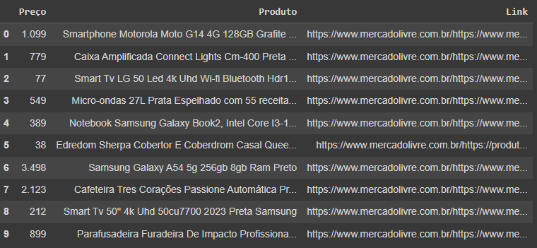

  <h1 align="center"
  >Extraindo dados do Mercado Livre com Python</h1>

  
Este código Python demonstra como extrair dados de produtos da página inicial do Mercado Livre e organizá-los em um DataFrame.

 

 # Funcionalidades:

  <ul>
    <li>Extrai o título, preço fracionário e link do produto.</li>
    <li>Organiza os dados em um DataFrame.</li>
    <li>Exibe as primeiras 10 linhas do DataFrame.</li>
  </ul>

  # Pré-requisitos:

  <ul>
    <li>Python 3.x instalado.</li>
    <li>Bibliotecas <code>requests</code>,
       <code
       >bs4</code> e 
      <code>pandas</code> 
      instaladas.</li>
  </ul>

# Como usar:

  <ol>
    <li>Clone este repositório ou salve o código em um arquivo Python.</li>
    <li>Instale as bibliotecas necessárias:</li>
    <pre><code>pip install requests bs4 pandas</code></pre>
    <li>Execute o código Python.</li>
  </ol>

 # Exemplo de saída:
 

# Observações:

> Este código é específico para a estrutura da página inicial do Mercado Livre em 2024-03-24.

- Mudanças na estrutura da página podem requerer adaptações no código.
